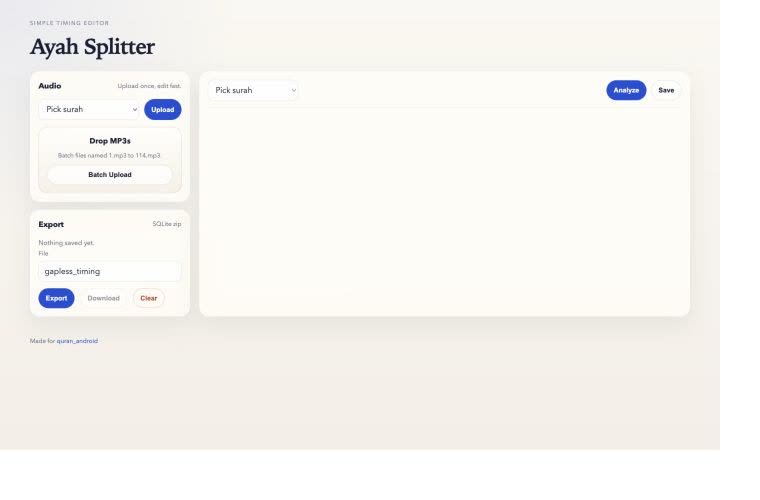
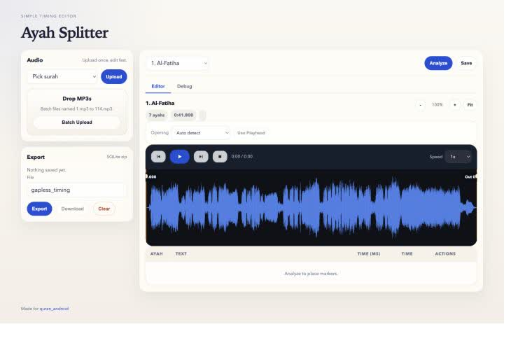

# Ayah Splitter

Ayah Splitter is a browser-based tool for finding and editing ayah boundaries in Quran recitation MP3 files. It combines a Quran-tuned Whisper model, canonical text alignment, and silence detection, then exports the reviewed timestamps as a SQLite database compatible with [quran_android](https://github.com/quran/quran_android).

## Screenshots

### Dashboard



### Waveform editor



## Features

- Upload one surah or a batch of MP3 files named `1.mp3` through `114.mp3`
- Estimate ayah boundaries with Quran-aware speech recognition and silence snapping
- Review results on a zoomable waveform and move markers manually
- Trim recording silence and control Basmallah handling
- Save work in the browser and export a compressed SQLite timing database

## Quick start with Docker

Requirements: [Docker](https://docs.docker.com/get-docker/) with Docker Compose.

```bash
git clone https://github.com/ZaherAirout/Ayah-Splitter.git
cd Ayah-Splitter
docker compose up --build
```

Open [http://localhost:8080](http://localhost:8080). The first analysis downloads the Quran-tuned Whisper model, so it may take longer than later runs.

To stop the app:

```bash
docker compose down
```

## Usage

1. Select a surah and upload its MP3, or batch-upload files named by surah number.
2. Click **Analyze** to generate initial ayah timestamps.
3. Review the waveform, trim controls, Arabic text, and timing table.
4. Drag markers or enter exact millisecond values where corrections are needed.
5. Click **Save**, then **Export** to download `gapless_timing.db.zip`.

Audio files in `audio_input/` and generated files in `output/` are intentionally excluded from Git.

## Project structure

```text
ayah-splitter/
├── backend/
│   ├── app.py                 # Flask API and static-file server
│   ├── audio_analyzer.py      # Audio analysis and boundary estimation
│   ├── ayah_aligner.py        # Whisper-to-Quran text alignment
│   ├── whisper_quran.py       # Quran-tuned Whisper transcription
│   ├── db_export.py           # SQLite and ZIP export
│   ├── quran_metadata.py      # Surah metadata and ayah counts
│   └── quran_text.py          # Canonical Quran text access
├── frontend/
│   ├── index.html
│   └── static/                # Browser JavaScript and CSS
├── audio_input/               # Local MP3 input (not committed)
├── output/                    # Generated databases (not committed)
├── docs/images/               # README screenshots
├── Dockerfile
└── docker-compose.yml
```

## Local development

Requirements: Python 3.12 and FFmpeg.

```bash
# macOS
brew install ffmpeg

python3.12 -m venv .venv
source .venv/bin/activate
pip install -r backend/requirements.txt

cd backend
UPLOAD_DIR=../audio_input OUTPUT_DIR=../output python app.py
```

Then open [http://localhost:8080](http://localhost:8080).

## Configuration

| Variable | Default | Purpose |
| --- | --- | --- |
| `PORT` | `8080` | Local Flask server port |
| `UPLOAD_DIR` | `/data/uploads` | Uploaded MP3 directory |
| `OUTPUT_DIR` | `/data/output` | Generated database directory |
| `QURAN_WHISPER_MODEL` | `OdyAsh/faster-whisper-base-ar-quran` | Hugging Face model name |
| `QURAN_WHISPER_DEVICE` | `cpu` | Inference device |
| `QURAN_WHISPER_COMPUTE_TYPE` | `int8` | faster-whisper compute type |
| `QURAN_WHISPER_BEAM_SIZE` | `5` | Transcription beam size |

## Export format

The exported archive contains a SQLite database with:

- `timings(sura, ayah, time)` — timestamps in milliseconds
- `properties(property, value)` — database and schema versions

Special ayah values are `0` for a separate Basmallah marker and `999` for the end of the surah.
